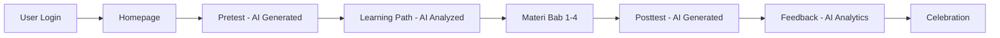
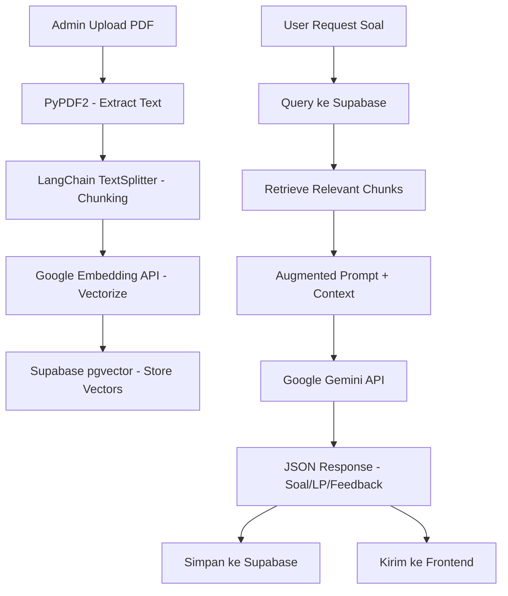

# 📋 Proposal Teknis: E-Learning AI Platform - Kemenkeu Learning
## Audit Internal Keuangan Negara dengan Adaptive Learning Path

---

## 1. Ringkasan Proyek

Platform e-learning berbasis web (HTML statis) yang menggunakan **Artificial Intelligence (AI)** dan **Retrieval-Augmented Generation (RAG)** untuk memberikan pengalaman belajar yang adaptif dan personal kepada setiap user. Platform ini ditujukan untuk Pusdiklat Digital Kementerian Keuangan RI.

### Alur Utama Sistem


---

## 2. Arsitektur Teknis

### 2.1. Arsitektur Keseluruhan

```
┌──────────────────────────────────────────────────────────┐
│                    FRONTEND (HTML Statis)                 │
│  index.html │ pretest.html │ learningpath.html │ dll.    │
│  Tailwind CSS │ Vanilla JS │ localStorage (sementara)    │
└───────────────────────┬──────────────────────────────────┘
                        │ HTTP Requests (fetch API)
                        ▼
┌──────────────────────────────────────────────────────────┐
│              BACKEND API (Python FastAPI)                 │
│  ┌────────────┐  ┌────────────┐  ┌──────────────────┐   │
│  │ User API   │  │ AI/RAG API │  │ Event Tracker API│   │
│  └────────────┘  └────────────┘  └──────────────────┘   │
│                        │                                  │
│              ┌─────────┴─────────┐                       │
│              ▼                   ▼                        │
│  ┌──────────────────┐  ┌──────────────────────────┐      │
│  │  Google Gemini   │  │  RAG Engine              │      │
│  │  API (Gratis)    │  │  (LangChain + ChromaDB)  │      │
│  └──────────────────┘  └──────────────────────────┘      │
└───────────────────────┬──────────────────────────────────┘
                        │
                        ▼
┌──────────────────────────────────────────────────────────┐
│              DATABASE & STORAGE (Supabase)                │
│  - Free Tier: 500MB DB, 1GB Storage                       │
│  - PostgreSQL dengan ekstensi pgvector                    │
└──────────────────────────────────────────────────────────┘
```

### 2.2. Tech Stack

| Layer | Teknologi | Biaya | Justifikasi |
|-------|-----------|-------|-------------|
| **Frontend** | HTML + Tailwind CSS + Vanilla JS | 🟢 Gratis | Sudah ada, rendering static |
| **Backend API** | Python + FastAPI | 🟢 Gratis | Ringan, async, cocok untuk AI pipeline |
| **AI/LLM** | Google Gemini API (gemini-2.0-flash) | 🟢 Gratis* | Free tier 15 RPM / 1M tokens/day |
| **RAG Engine** | LangChain + ChromaDB | 🟢 Gratis | Open-source, local vector DB |
| **PDF Parsing** | PyPDF2 / pymupdf | 🟢 Gratis | Open-source |
| **Database** | Supabase (PostgreSQL) | 🟢 Gratis* | Free tier cukup untuk prototype |
| **Vector DB**| pgvector (via Supabase) | 🟢 Gratis | Terintegrasi langsung dengan database |
| **Storage**  | Supabase Storage | 🟢 Gratis | Untuk menyimpan PDF Materi |
| **Hosting Backend** | Railway.app | 🟢 Gratis* | Free tier tersedia |
| **Hosting Frontend** | GitHub Pages / Netlify | 🟢 Gratis | Static hosting |
| **Embedding Model** | Google Embedding API / all-MiniLM-L6-v2 | 🟢 Gratis | Free tier / open-source local |

> \* Free tier dengan limitasi. Untuk production scale perlu upgrade ke paid tier.

---

## 3. Komponen Sistem Detail

### 3.1. Frontend (HTML Statis - Sudah Ada)

File yang sudah ada dan perannya:

| File | Fungsi | Status |
|------|--------|--------|
| `index.html` | Homepage / Dashboard | ✅ UI Siap |
| `pretest.html` | Halaman Pretest | ✅ UI Siap |
| `learningpath.html` | Halaman Learning Path | ✅ UI Siap |
| `materi.html` | Halaman Materi Pembelajaran | ✅ UI Siap |
| `postest.html` | Halaman Posttest | ✅ UI Siap |
| `feedback.html` | Halaman AI Feedback & Analytics | ✅ UI Siap |
| `celebration.html` | Halaman Celebration | ✅ UI Siap |

**Yang perlu ditambahkan di Frontend:**
- File `api.js` → module untuk komunikasi dengan backend API
- File `auth.js` → modul identifikasi user (input Nama + NIP)
- Modifikasi setiap HTML → mengganti data statis/placeholder dengan data dinamis dari API
- Loading animation saat menunggu respons AI
- Event listener tracking (waktu per halaman, interaksi)

### 3.2. Backend API (Python FastAPI) - PERLU DIBUAT

```
backend/
├── main.py              # FastAPI app entry point
├── requirements.txt     # Dependencies
├── .env                 # API keys & config
├── routers/
│   ├── user.py          # CRUD user data
│   ├── pretest.py       # Generate & manage pretest
│   ├── posttest.py      # Generate & manage posttest
│   ├── learning_path.py # Generate learning path
│   ├── feedback.py      # Generate AI feedback
│   └── tracker.py       # Event listener data
├── services/
│   ├── ai_service.py    # Gemini API integration
│   ├── rag_service.py   # RAG pipeline (PDF → chunks → embedding → pgvector)
│   └── db_service.py    # Supabase operations
├── models/
│   ├── user.py          # User data models
│   ├── pretest.py       # Pretest data models
│   ├── posttest.py      # Posttest data models
│   └── feedback.py      # Feedback data models
└── data/
    └── materi/          # Folder PDF materi dari admin
        ├── bab1.pdf
        ├── bab2.pdf
        ├── bab3.pdf
        └── bab4.pdf
```

### 3.3. AI & RAG Pipeline



**RAG Flow Detail:**
1. **Indexing Phase (1x oleh Admin):**
   - PDF materi di-parse menggunakan `PyPDF2`
   - Teks di-split menjadi chunks (500-1000 token per chunk)
   - Setiap chunk di-embed menggunakan model embedding
   - Vektor disimpan di Supabase menggunakan ekstensi `pgvector`

2. **Query Phase (setiap request User):**
   - User request (misal: "buatkan soal pretest")
   - Query di-embed dan di-match dengan chunks yang relevan
   - Top-K chunks diambil sebagai konteks
   - Konteks + prompt template dikirim ke Gemini API
   - Hasil JSON dikembalikan ke frontend

### 3.4. Database Schema (Supabase PostgreSQL)

```sql
-- Tabel Users
CREATE TABLE users (
    nip VARCHAR PRIMARY KEY,
    nama VARCHAR NOT NULL,
    created_at TIMESTAMP DEFAULT NOW()
);

-- Tabel Pretest
CREATE TABLE pretest (
    id SERIAL PRIMARY KEY,
    nip VARCHAR REFERENCES users(nip),
    soal JSONB,
    nilai INTEGER,
    completed BOOLEAN DEFAULT FALSE,
    completed_at TIMESTAMP
);

-- Tabel Learning Path
CREATE TABLE learning_path (
    id SERIAL PRIMARY KEY,
    nip VARCHAR REFERENCES users(nip),
    profil VARCHAR,
    penjabaran TEXT,
    skor_pretest INTEGER,
    bab_fokus JSONB,
    bab_opsional JSONB,
    generated_at TIMESTAMP DEFAULT NOW()
);

-- Tabel Materi Progress
CREATE TABLE materi_progress (
    id SERIAL PRIMARY KEY,
    nip VARCHAR REFERENCES users(nip),
    bab VARCHAR,
    finished BOOLEAN DEFAULT FALSE,
    time_spent_seconds INTEGER DEFAULT 0,
    updated_at TIMESTAMP DEFAULT NOW()
);

-- Tabel Events Tracker
CREATE TABLE events (
    id SERIAL PRIMARY KEY,
    nip VARCHAR REFERENCES users(nip),
    page VARCHAR,
    action VARCHAR,
    duration_seconds INTEGER,
    timestamp TIMESTAMP DEFAULT NOW()
);

-- Tabel Posttest
CREATE TABLE posttest (
    id SERIAL PRIMARY KEY,
    nip VARCHAR REFERENCES users(nip),
    soal JSONB,
    nilai INTEGER,
    completed BOOLEAN DEFAULT FALSE,
    completed_at TIMESTAMP
);

-- Tabel Feedback
CREATE TABLE feedback (
    id SERIAL PRIMARY KEY,
    nip VARCHAR REFERENCES users(nip),
    profil_akhir VARCHAR,
    analisis_perkembangan TEXT,
    evaluasi_perilaku TEXT,
    transformasi_profil TEXT,
    kesimpulan_strategis TEXT,
    generated_at TIMESTAMP DEFAULT NOW()
);

-- Tabel Vector untuk RAG (menggunakan ekstensi pgvector)
CREATE TABLE materi_chunks (
    id bigserial primary key,
    content text,
    metadata jsonb,
    embedding vector(768) -- Sesuaikan dengan dimensi embedding Google
);
```

---

## 4. API Endpoints

### 4.1. User Management

| Method | Endpoint | Deskripsi |
|--------|----------|-----------|
| `POST` | `/api/user/register` | Register user baru (nama, NIP) |
| `GET` | `/api/user/{nip}` | Ambil data user lengkap |
| `GET` | `/api/user/{nip}/status` | Cek progress state user |

### 4.2. Pretest

| Method | Endpoint | Deskripsi |
|--------|----------|-----------|
| `GET` | `/api/pretest/{nip}` | Ambil soal pretest (generate jika belum ada) |
| `POST` | `/api/pretest/{nip}/submit` | Submit jawaban pretest, hitung nilai |

### 4.3. Learning Path

| Method | Endpoint | Deskripsi |
|--------|----------|-----------|
| `GET` | `/api/learning-path/{nip}` | Ambil learning path (generate jika belum ada) |

### 4.4. Materi & Tracking

| Method | Endpoint | Deskripsi |
|--------|----------|-----------|
| `GET` | `/api/materi/{nip}/progress` | Ambil progress materi user |
| `POST` | `/api/materi/{nip}/track` | Kirim event tracking data |
| `POST` | `/api/materi/{nip}/complete/{bab}` | Tandai bab sebagai selesai |

### 4.5. Posttest

| Method | Endpoint | Deskripsi |
|--------|----------|-----------|
| `GET` | `/api/posttest/{nip}` | Ambil soal posttest (generate jika belum ada) |
| `POST` | `/api/posttest/{nip}/submit` | Submit jawaban posttest, hitung nilai |

### 4.6. Feedback

| Method | Endpoint | Deskripsi |
|--------|----------|-----------|
| `GET` | `/api/feedback/{nip}` | Ambil feedback AI (generate jika belum ada) |

### 4.7. Admin

| Method | Endpoint | Deskripsi |
|--------|----------|-----------|
| `POST` | `/api/admin/upload-pdf` | Upload materi PDF ke Supabase Storage |
| `POST` | `/api/admin/index-pdf` | Index PDF dari Storage ke pgvector |

---

## 5. Contoh Prompt AI untuk Setiap Fitur

### 5.1. Prompt Generate Soal Pretest/Posttest

```
Kamu adalah pembuat soal ujian untuk materi Audit Internal Keuangan Negara.

Berdasarkan konteks materi berikut:
---
{retrieved_context_from_rag}
---

Buatkan 30 soal pilihan ganda untuk {pretest/posttest}.
Distribusikan soal secara merata dari semua bab materi.
Tingkat kesulitan: campuran mudah (30%), sedang (50%), sulit (20%).

FORMAT OUTPUT (JSON):
{
  "soal": [
    {
      "nomor": 1,
      "pertanyaan": "...",
      "opsi": ["A. ...", "B. ...", "C. ...", "D. ..."],
      "jawaban_benar": "C",
      "bab_referensi": "Bab 1"
    }
  ]
}

PENTING: Soal HARUS berdasarkan konteks materi yang diberikan. Jangan membuat soal di luar konteks.
```

### 5.2. Prompt Generate Learning Path

```
Kamu adalah sistem AI untuk platform e-learning Kemenkeu.

Data User:
- Nilai Pretest: {nilai_pretest}/100
- Detail per Bab:
  - Bab 1 ({judul}): {benar}/{total} soal benar
  - Bab 2 ({judul}): {benar}/{total} soal benar
  - Bab 3 ({judul}): {benar}/{total} soal benar
  - Bab 4 ({judul}): {benar}/{total} soal benar

Buatkan learning path personal dengan format JSON:
{
  "profil": "Pemula|Menengah|Mahir",
  "penjabaran_profil": "Deskripsi analisis kemampuan user...",
  "skor_pretest": {nilai},
  "learning_path": {
    "fokus_utama": ["Bab X", "Bab Y"],
    "wajib": ["Bab A", "Bab B"],
    "opsional": ["Bab C"],
    "urutan_rekomendasi": ["Bab ...", "Bab ...", ...]
  },
  "rekomendasi": "Saran singkat untuk user..."
}
```

### 5.3. Prompt Generate Feedback

```
Kamu adalah analis AI pembelajaran. Buat laporan feedback komprehensif.

DATA PEMBELAJARAN:
- Nilai Pretest: {pretest}/100
- Nilai Posttest: {posttest}/100
- Profil Awal: {profil_awal}
- Learning Path yang diberikan: {learning_path}
- Waktu belajar per bab:
  - Bab 1: {time1} menit
  - Bab 2: {time2} menit
  - Bab 3: {time3} menit
  - Bab 4: {time4} menit
- Event Tracking: {events_json}

FORMAT OUTPUT (JSON):
{
  "profil_akhir": "...",
  "analisis_perkembangan": "Paragraf analisis perbandingan pretest-posttest...",
  "evaluasi_perilaku": "Paragraf analisis behavior learning berdasarkan event tracker...",
  "transformasi_profil": "Paragraf transformasi profil dari awal ke akhir...",
  "kesimpulan_strategis": "Paragraf saran dan next actions..."
}
```

---

## 6. Alur Kerja Detail per Halaman

### 6.1. Homepage (`index.html`)

```
User buka homepage
  → JS fetch GET /api/user/{nip}/status
  → Jika user belum ada → tampilkan modal input Nama & NIP
    → POST /api/user/register
  → Jika user sudah ada → load progress state
    → Update UI (unlock/lock modul sesuai progress)
```

### 6.2. Pretest (`pretest.html`)

```
User buka pretest
  → JS fetch GET /api/pretest/{nip}
  → Jika soal sudah ada di DB → tampilkan soal
  → Jika belum ada → Backend:
    1. RAG query ke Supabase (pgvector) (ambil konteks semua bab)
    2. Send augmented prompt ke Gemini API
    3. Parse JSON response (30 soal)
    4. Simpan ke Supabase PostgreSQL
    5. Return ke frontend
  → Tampilkan loading animation selama proses
  → User mengerjakan soal
  → Submit → POST /api/pretest/{nip}/submit
  → Backend hitung nilai, simpan ke DB
  → Tampilkan hasil + ulasan jawaban
```

### 6.3. Learning Path (`learningpath.html`)

```
User buka learning path
  → JS fetch GET /api/learning-path/{nip}
  → Jika sudah ada di DB → tampilkan
  → Jika belum → Backend:
    1. Ambil hasil pretest dari DB
    2. Analisis score per bab
    3. Send prompt ke Gemini API
    4. Parse JSON response
    5. Simpan ke Supabase
    6. Return ke frontend
  → Tampilkan profil user + modul rekomendasi
```

### 6.4. Materi (`materi.html`)

```
User buka materi (bab tertentu)
  → JS mulai tracking waktu (event listener)
  → Setiap 30 detik → POST /api/materi/{nip}/track (heartbeat)
  → User klik "Tandai Selesai"
  → POST /api/materi/{nip}/complete/{bab}
  → Update progress state
```

### 6.5. Posttest (`postest.html`)

```
Alur sama dengan Pretest, tapi:
  → Soal di-generate terpisah (berbeda dari pretest)
  → Passing grade: 75/100
  → Kesempatan: 2 kali
```

### 6.6. Feedback (`feedback.html`)

```
User buka feedback
  → JS fetch GET /api/feedback/{nip}
  → Jika sudah ada di DB → tampilkan
  → Jika belum → Backend:
    1. Ambil data pretest, posttest, learning path, event tracker dari DB
    2. Compile semua data
    3. Send comprehensive prompt ke Gemini API
    4. Parse JSON response
    5. Simpan ke Supabase
    6. Return ke frontend
  → Tampilkan analytics card + detailed report
```

---

## 7. Estimasi Biaya & Limitasi Free Tier

### 7.1. Google Gemini API (Free Tier)

| Limitasi | Nilai |
|----------|-------|
| RPM (requests per minute) | 15 |
| TPM (tokens per minute) | 1,000,000 |
| RPD (requests per day) | 1,500 |

**Estimasi per user:** ~5-7 API calls (pretest, learning path, posttest, feedback)
**Kapasitas free tier:** ~200-300 user/hari ✅

### 7.2. Supabase (Free Tier)

| Resource | Free Quota |
|----------|------------|
| Database Storage | 500 MB |
| File Storage | 1 GB |
| Bandwidth | 5 GB / month |
| API Requests | Unlimited |

**Estimasi per user:** Sangat kecil datanya untuk teksJSON.
**Kapasitas free tier:** Lebih dari cukup untuk prototype scale. ✅

### 7.3. Hosting Railway (Free Tier)

| Platform | Free Tier |
|----------|-----------|
| Railway.app | $5 credit/bulan |

> **Rekomendasi:** Gunakan **Railway.app** untuk backend FastAPI. Sangat mudah deploy dari GitHub dan memiliki native support untuk Python.

### 7.4. GitHub Pages (Frontend Hosting)

| Resource | Free Quota |
|----------|------------|
| Storage | 1 GB |
| Bandwidth | 100 GB / month |
| Sites | Unlimited public repos |

**Gratis sepenuhnya** untuk hosting HTML statis ✅

---

## 8. Timeline Pengembangan

| Fase | Durasi | Detail |
|------|--------|--------|
| **Fase 1: Setup** | 1-2 hari | Setup Supabase, Gemini API key, project structure |
| **Fase 2: Backend Core** | 3-5 hari | FastAPI, Supabase client, user management |
| **Fase 3: RAG Pipeline** | 2-3 hari | PDF extraction, chunking, penyimpan ke pgvector |
| **Fase 4: AI Integration** | 3-4 hari | Prompt engineering, soal generator, LP generator, feedback generator |
| **Fase 5: Frontend Integration** | 3-4 hari | Connect HTML ke API, loading states, dynamic content |
| **Fase 6: Event Tracking** | 1-2 hari | Implementasi time tracking & behavior logging |
| **Fase 7: Testing & Polish** | 2-3 hari | End-to-end testing, bug fixes, UI polish |
| **Total** | **~15-23 hari** | |

---

## 9. Risiko & Mitigasi

| Risiko | Impact | Mitigasi |
|--------|--------|----------|
| Gemini API rate limit | Soal gagal generate | Implementasi retry logic + queue system |
| AI halusinasi soal | Soal tidak relevan | RAG memastikan konteks dari PDF asli |
| Supabase credit habis | Service down | Monitor DB size, hapus log lama jika perlu |
| Railway credit habis | Backend mati | Monitor usage, optimize resource di dockerfile |
| PDF parsing gagal | RAG tidak akurat | Validasi format PDF, fallback ke manual text |

---

## 10. Dependencies & Requirements

### 10.1. Python Dependencies (`requirements.txt`)

```
fastapi==0.115.0
uvicorn==0.30.0
python-dotenv==1.0.1
supabase==2.3.0
google-generativeai==0.8.0
langchain==0.3.0
langchain-community==0.3.0
langchain-google-genai==2.0.0
langchain-postgres==0.0.1
psycopg2-binary==2.9.9
pymupdf==1.23.0
pydantic==2.9.0
python-multipart==0.0.9
```

### 10.2. Environment Variables (`.env`)

```
GEMINI_API_KEY=your_gemini_api_key_here
SUPABASE_URL=https://your-project.supabase.co
SUPABASE_KEY=your-supabase-service-role-key
CORS_ORIGINS=http://localhost,https://your-frontend.github.io
```

---

## 11. Kesimpulan

Proyek ini **sangat layak** dibangun menggunakan **service gratis** untuk fase prototype dan testing. Semua komponen utama memiliki free tier yang cukup:

- ✅ **AI/LLM:** Google Gemini API Free Tier
- ✅ **RAG:** LangChain + ChromaDB (Open Source) , dan supabase tempat simpan PDF (Storage) dan Vector Database (pgvector)
- ✅ **Database:** supabase Free Tier
- ✅ **Backend Hosting:** railway.com Free Tier
- ✅ **Frontend Hosting:** GitHub Pages (Gratis)
- ✅ **Frontend:** HTML + Tailwind CSS (Sudah ada)

Total biaya untuk prototype: **Rp 0 (GRATIS)** 🎉

Untuk production dengan user masif, estimasi biaya upgrade:
- Gemini API: Tetap gratis (atau ~$0.075/1M tokens jika upgrade ke pay-as-you-go)
- Supabase: ~$25/bulan (Pro plan)
- Railway: Sesuai pemakaian (Pro plan base $5 + usage)
- **Total production: ~$35/bulan (~Rp 550.000/bulan)**
